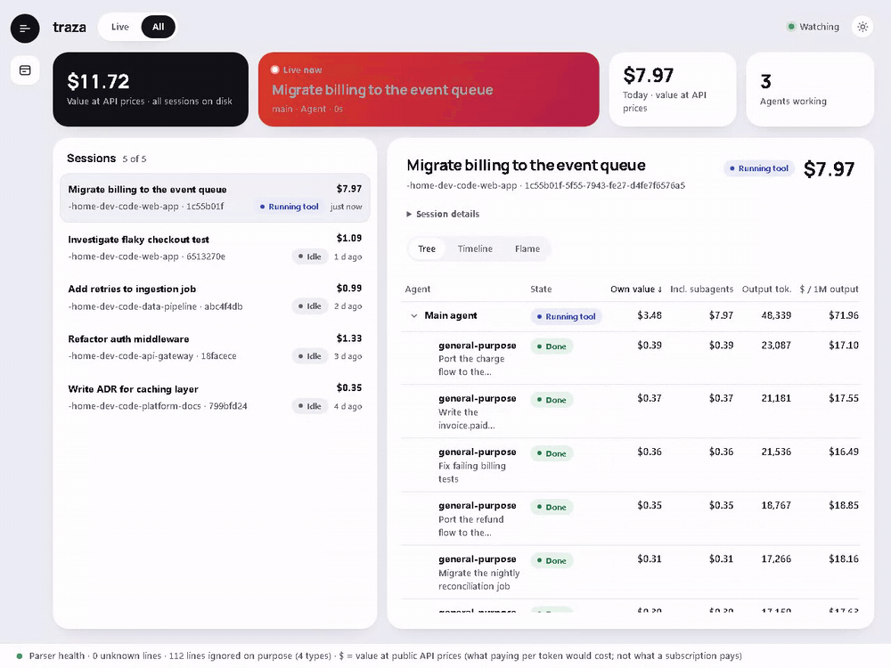

# traza

A local, read-only, live panel for Claude Code: it reads the session logs Claude Code already
writes on your disk and shows every agent and subagent, what each one is doing right now, and
what each one consumed.



*The GIF uses synthetic sessions made by [`tools/make_demo_data.py`](tools/make_demo_data.py),
not real ones.*

## Install

```sh
pipx install git+https://github.com/LanderIglesias/traza
# or: uv tool install git+https://github.com/LanderIglesias/traza
traza serve
```

It opens `http://127.0.0.1:7420` in your browser. Python 3.11+, two dependencies (FastAPI,
uvicorn), no account, no API key, nothing leaves your machine. The first start builds a local
cache (`~/.traza/traza.db`): about 3 s for 110,000 log lines here, longer on a cold disk or with
an antivirus scanning; after that it only reads what is new.

## What it does

- **Agent tree, live.** Every session with its agents and subagents, nested as they were
  launched, each with its state (running a tool, thinking, idle, done), updated as Claude Code
  writes. A Timeline tab shows when each agent worked.
- **Value per agent.** Tokens and their value at API prices for each request, agent, subagent
  and session, own and including everything below it. The Flame tab sizes each agent by that
  value, so forty `general-purpose` subagents stop looking identical.
- **Judgement view.** For any agent: the task it was given, its tool calls turn by turn (the
  full text is read from the log on demand, never copied), and what it returned to its parent.
- **Signals.** Tool errors, blocked calls, API errors, loops (the same call three times in a
  row), retries, hung tools and context compactions, each linked to the turn where it happened.

## What it does not do

- It does not think: no model calls, no summaries, no "AI insights". Everything shown is read
  from the logs or computed from them.
- It does not launch, stop or steer agents. It never writes to `~/.claude`.
- It does not keep history. It mirrors what Claude Code keeps on disk (see the next section).
- It does not show the model's reasoning: Claude Code stores thinking blocks with empty text.

## Your history is a rolling 30-day window

Claude Code deletes session logs after 30 days by default (`cleanupPeriodDays` in its
settings). traza mirrors the disk: when a log is deleted, its data leaves the panel, so the
panel always covers about the last 30 days. To keep more, raise `cleanupPeriodDays`. traza does
not copy logs to build its own archive; that would be a different product.

## What the dollar figures mean

**They are not money you spent.** They are what those tokens would cost at Anthropic's public
API prices (`traza/prices.toml`). With a Claude subscription you don't pay per token, but the
figure still tells you where the volume went.

- **Estimated, and checked.** Now and then Claude Code writes a `cost-state` line with its own
  per-model token count for the running process. A test compares traza's count against it
  ([`tests/test_oracle.py`](tests/test_oracle.py), run locally against real logs). On this disk
  four sessions have one. In three of them traza matches **to the token and to the
  micro-dollar** (e.g. 23,334 output tokens and $2.012743 on both sides). In one of those three,
  Claude Code's counter had restarted after an 18-hour pause without changing its start time;
  measured by hand from the restart, it matches exactly. The fourth is a copied session whose log carries
  history that process never spent, and it is reported as such. These lines are rare, so this is a spot check of accuracy, not a
  regression suite, and it cannot catch a mistake that traza and the check would both make.
  Separate tests cover each counting rule with data where the wrong rule gives a different answer.
- **`?` means unknown, never zero.** A model missing from the price table, or a request without
  usage, shows `?`. A total with some unknown parts shows `$X+`.
- **Internal cost is "at least".** Claude Code makes calls of its own (titles, summaries, usually
  on a small model) and does not write them to the log. traza measures them from `cost-state`,
  but only for models the session never used in a request: calls to a model the session also
  used can't be separated. So the health bar says "internal cost measured: at least $0.09 in
  3 sessions", and says nothing when there is nothing to measure.
- **Implausible output counts are flagged, not fixed.** Sometimes Claude Code never writes the
  final line of a response with its full token count (466 requests on this disk, e.g. 7 output
  tokens for 10,254 characters of text). traza counts them in the health bar; it can't recover
  the real number.

One thing the Flame view showed on this disk: in the two sessions with 40+ subagents, the main
thread took 90% and 96% of the value. Launching many subagents was not what made those sessions
expensive; carrying the main thread's long context was. In a session where a task was split
into 24 short subagents, they took 57%.

## Known limits

- **Subagents with no recorded end.** 3 of 131 subagents on this disk never get an end written
  by Claude Code, so they stay "idle" instead of "done" (a tooltip says why). This is what the
  log contains, not a panel bug.
- **Live truncation is tested, not exercised live.** Detecting a log that is truncated or
  replaced while the server runs is covered by tests, but was not reproduced against a real log
  during a live session, to avoid risking real data.
- **Other local accounts.** The server listens only on `127.0.0.1` and rejects foreign `Host`
  and `Origin` headers, but a process of another user account on the same machine can read the
  panel while it runs. On a single-user laptop that crosses no boundary. Not yet validated:
  whether another account that takes the port while traza is stopped could leave a service
  worker behind in your browser (it needs a two-account test).

## How it is built

FastAPI + Server-Sent Events + SQLite (WAL), and plain HTML, CSS and JavaScript: no build step,
no frontend framework, no CDN. A watcher reads new log lines every 0.5 s into a disposable cache:
delete it and it is rebuilt from the logs. Log text is always rendered with `textContent`, never
as HTML. Every design decision and the evidence behind it: [`docs/design.md`](docs/design.md),
[`docs/findings.md`](docs/findings.md).

```sh
pip install -e ".[dev]"
pytest    # the Flame layout tests need Node (skipped without it); test_oracle reads ~/.claude
```

## License

MIT
