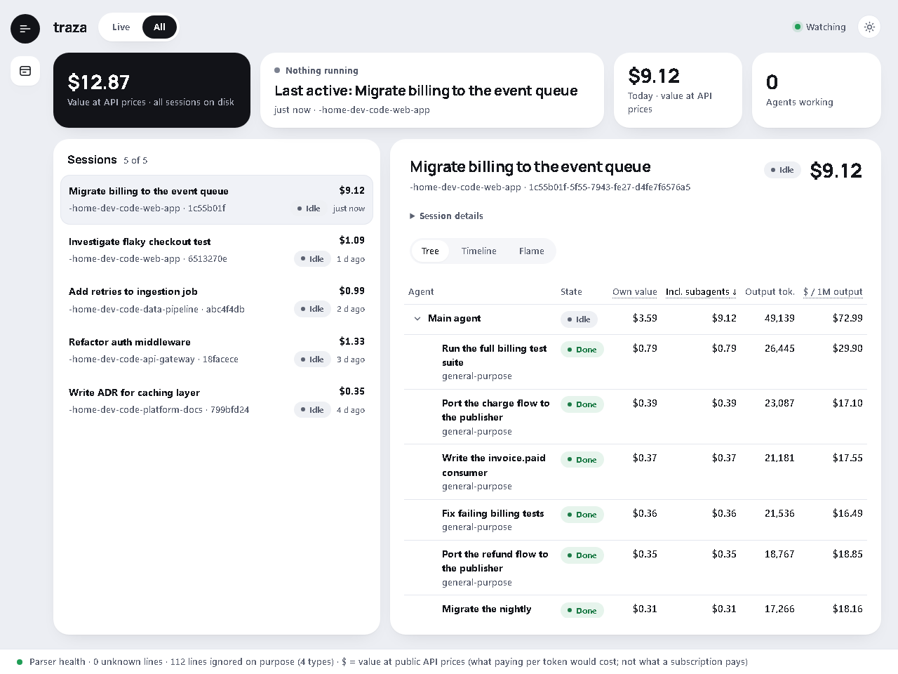

# traza

A local, read-only, live dashboard for Claude Code. It reads the session logs Claude Code already
writes and shows every agent and subagent: what each one is doing now, what its tokens are worth
at API prices (what they would cost on Anthropic's API, not what you paid), and what it actually
did, so you can judge whether it did its job. Nothing leaves
your machine.

Knowing what a session cost is easy. Knowing whether dozens of subagents did useful work is not:
traza puts each agent's task, tool calls, result and a few automatic signals side by side, live.




*Both images use synthetic sessions, not real logs.*

**Status:** v0.1.0, early. Developed and tested on Windows 11 with logs from Claude Code
2.1.226–2.1.288.

## Install

You need Python 3.11+ and a machine where Claude Code has already run. traza reads its logs
(in `~/.claude/projects`); with no logs, the panel starts empty until a session begins.

```sh
pipx install git+https://github.com/LanderIglesias/traza
# or: uv tool install git+https://github.com/LanderIglesias/traza
# or, without pipx/uv: pip install git+https://github.com/LanderIglesias/traza
traza serve
```

`traza serve` opens `http://127.0.0.1:7420` in your browser. No account, no API key. The first
start builds a local cache (`~/.traza/traza.db`): 3–6 s for about 110,000 log lines on the
author's machine, longer on a cold disk or with an antivirus scanning. After that it only reads
new lines.

## Usage

```sh
traza serve                    # the dashboard; Ctrl+C to stop
traza serve --port 7421        # if 7420 is taken (traza says so and exits)
traza serve --no-open          # don't open the browser
traza scan                     # build or refresh the cache and print what it holds
traza report SESSION.jsonl     # tokens and value per model of one session, straight from the log
```

`--root` and `--db` point traza at other log and cache locations. To remove everything traza
created, delete `~/.traza`.

## What it does

Each session has three tabs: **Tree** (agents nested as they were launched), **Timeline** (when
each one was working) and **Flame** (a flame chart where width = value).

- **Agent tree, live.** Every session with its agents and subagents, each with its state
  (running a tool, thinking, idle, done), updated as Claude Code writes.
- **Value per agent.** Tokens and their value at API prices, per request, agent and session, for
  each agent alone and including the subagents it launched. In the Flame tab, forty subagents of
  the same type stop looking identical: each is as wide as its share of the value.
- **Per-agent detail ("judgement view").** For any agent: the task it was given, its tool calls
  turn by turn, and what it returned to its parent. Long text is read from the log when you open
  it; the cache doesn't copy it.
- **Signals.** Tool errors, calls blocked by permissions or hooks, API errors, loops (the same
  call three times in a row), retries, tools that seem stuck, and context compactions, each
  linked to the turn where it happened.

A **health bar** at the bottom says how much of the logs traza understood: lines it didn't
recognise, lines it skips on purpose, and requests whose token counts look wrong.

## What it does not do

- It does not think: no model calls, no summaries, no "AI insights". Everything shown is read
  from the logs or computed from them.
- It does not launch, stop or steer agents. It never writes to `~/.claude`.
- It does not show the model's reasoning: Claude Code stores thinking blocks with empty text.
- It does not keep history. It mirrors the logs on disk, and Claude Code deletes them after
  30 days by default, so the panel covers a rolling 30-day window. To keep more, raise
  `cleanupPeriodDays` in Claude Code's settings. traza won't archive logs itself; that would be
  a different product.

## What the figures mean

**Value at API prices is not money you spent.** It is what the tokens would cost at Anthropic's
public API prices ([`traza/prices.toml`](traza/prices.toml)). With a subscription you don't pay
per token, but it still shows where the volume went.

**How the token counts are checked.** Now and then Claude Code writes a `cost-state` line: its
own running per-model token total for the current process. A test
([`tests/test_oracle.py`](tests/test_oracle.py), run locally against real logs) compares traza's
count with it. Four sessions on the author's machine have one:

- In two, the automated check matches **to the token and to the micro-dollar** (e.g. 23,334
  output tokens and $2.012743 on both sides).
- In a third, Claude Code's own counter restarted mid-session, after an 18-hour pause, without
  changing its start time, so the automated comparison disagrees. Counted by hand from the
  restart, it matches exactly.
- The fourth is a copied session: its log carries history the process never spent, so it is
  reported, not compared.

These lines are rare, so this is a spot check of accuracy, not a regression suite. It also
cannot catch a mistake that traza and the check would both make; separate tests cover each
counting rule with data where a wrong rule gives a different answer.

Other rules behind the numbers:

- **`?` means unknown, never zero.** A model missing from the price table, or a request without
  token counts, shows `?`. A total with some unknown parts shows `$X+`.
- **Internal cost is "at least".** Claude Code makes some calls of its own (titles, summaries)
  that never appear in the log, so their cost is invisible to a log reader. traza reports what it
  can measure and marks it as a minimum: it reads them from `cost-state`, but only for models the
  session never used in a logged request, because calls to a model it also used can't be
  separated. The health bar then says "internal cost measured: at least $0.09 in 3 sessions", and
  says nothing when there is nothing to measure.
- **Implausible token counts are flagged, not fixed.** Sometimes Claude Code never writes the
  final line of a response with its full token count (e.g. 7 output tokens for 10,254 characters
  of text). traza counts these in the health bar; it can't recover the real number.

**On the author's machine** (65 sessions, 3 October 2026): 0 unknown lines; 63% of lines ignored
on purpose, mostly hook output and session metadata; 467 requests flagged as implausible. And
what the Flame view showed: in the two sessions with about 40 subagents (42 and 39), the main
agent accounted for 90% and 96% of the value. The many subagents were cheap; re-reading and
re-caching the main agent's long context on every request was the expensive part. In a session
where a task was split into 24 short subagents, the subagents took 57%.

## Known limits

- **Subagents with no recorded end.** For 3 of 132 subagents on the author's machine, Claude
  Code never wrote an end, so they stay "idle" instead of "done" (a tooltip says why). The log
  doesn't contain it; it is not a panel bug.
- **Logs rewritten while traza runs.** Detecting a log that is truncated or replaced during a
  live session is covered by tests, but was not reproduced against real logs, to avoid risking
  them.
- **Other user accounts on the same machine.** The server listens only on `127.0.0.1` and
  rejects requests whose `Host` or `Origin` isn't its own (protection against DNS rebinding),
  but another user account on the same computer can read the dashboard while it runs. On a
  single-user machine that crosses no boundary. One related browser scenario is not yet
  validated (notes in [`docs/design.md`](docs/design.md) §9).

## How it is built

Two runtime dependencies: FastAPI and uvicorn. The stack is FastAPI + Server-Sent Events +
SQLite (WAL), with plain HTML, CSS and JavaScript: no build step, no frontend framework, no CDN. A watcher
reads new log lines every 0.5 s into a disposable cache: if it's ever corrupted or out of date,
delete it and it is rebuilt from the logs, which are the source of truth. Log text is always
rendered with `textContent`, never as HTML. Design decisions and the evidence behind them, in
Spanish: [`docs/design.md`](docs/design.md), [`docs/findings.md`](docs/findings.md).

```sh
pip install -e ".[dev]"
pytest    # Flame layout tests need Node and are skipped without it; test_oracle is skipped without real logs
```

## License

MIT
